```{r setup, include=FALSE}
knitr::opts_chunk$set(echo = FALSE, message=FALSE, warning=FALSE, fig.align="center")
```

# Introdução

## Retenção de clientes

- Atender um cliente se torna menos dispendioso a cada ano de relacionamento
- O custo para atrair um novo cliente pode ser de 5 a 25 vezes superior ao da manutenção de um já existente
- Desenvoler estratégias de retenção é uma prática comum em diversos segmentos
- Antever clientes propensos a abandonar o relacionamento (churn) se tornou um anseio constante

## Proposta

- Um modelo preditivo para apoiar as estratégias de retenção da startup Olist
  - Classificação de churn
  - Interpretação dos principais motivos que impactam o desfecho
- Regressão logística
  - Modelagem híbrida multicritério considerando múltiplos decisores da empresa
  - Altamente confiável
  - Possibilita a interpretação direta dos parâmetros
  - Oferece a resposta na escala de probabilidade

# Materiais e Métodos

## Estruturação do conjunto de dados

- Extensivo processo de data wrangling
- Definição da variável resposta
- Criação de covariáveis de desempenho
- Inclusão de outras covariáveis qualitativas e quantitativas

## Definição da variável resposta

- Vendedores pelo menos 30 dias inativos ($Y=1$)
- Inatividade: não acesso à plataforma e a não realização de vendas online
  
## Criação de covariáveis de desempenho

- Definida uma data de corte
- Período de 90 dias dividido em 2 subperíodos
- $V2 /(V1+V2)$, sendo V1 e V2 os valores calculados nos subperíodos
- Faturamento, ticket médio, pedidos cancelados, produtos publicados...

::: columns

:::: column
```{r, out.width='100%'}
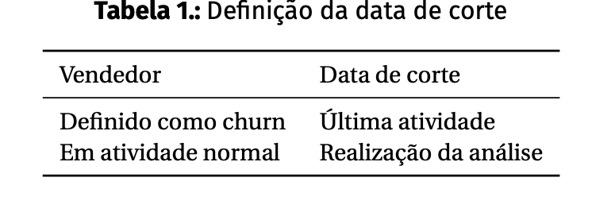
```
::::

:::: column
```{r, out.width='100%'}
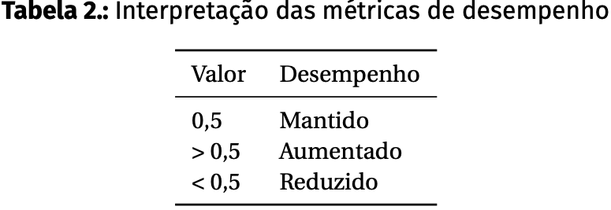
```
::::

:::

## Outras covariáveis

- Qualitativas: tipo de plano, região, estágio...
- Quantitativas: faturamento, pedidos, dias de atividade...
- Total: 31 covariáveis

## Regressão Logística

- Probabilidade de ocorrência de um evento de interesse

$$
\begin{aligned}
\ln \left ( \dfrac{\pi_i}{1-\pi_i} \right ) = \beta_0 + \beta_1 X_{i1} + ... +  \beta_p X_{ip}
\end{aligned}
$$
&NewLine;

$$
\begin{aligned}
\pi_i = \dfrac{1}{1 + e^{-(\beta_0 + \beta_1 X_{i1} + ... +  \beta_p X_{ip})}}
\end{aligned}
$$

## Regressão Logística

- Estimação por máxima verossimilhança

$$
\begin{aligned}
L =  \prod_{i=1}^{n} \left[ \pi_i^{Y_i} (1-\pi_i)^{1-Y_i} \right]
\end{aligned}
$$
&NewLine;

$$
\begin{aligned}
\log L = \sum_{i=1}^{n} \left\{ \big[Y_i\ln(\pi_i)\big] + \big[(1-Y_i)\ln(1-\pi_i)\big] \right\}
\end{aligned}
$$

## Ajuste do modelo e seleção de covariáveis

- Amostragem de 75% para o treinamento do modelo
  - 47,3% de ocorrência de \textit{churn}
- Validação cruzada K-fold com 5 folds
- Modelo completo: todas as covariáveis
- Modelo restrito: algoritmo \textit{stepwise}
  - Minimização do AIC ($-2\log{L} + 2p$)
  - Múltiplo de penalização utilizado: 3,841459 ($\chi^2$ com 1 grau de liberdade e 5% de significância)
  - P-valor = 0,05 como valor crítico para seleção das covariáveis

# Resultados e discussões

## Teste da razão da verossimilhança

- TRV < ${\chi}^2$ com 17 graus de liberdade e 5% de significância
- A qualidade do ajuste não foi afetada ($H_0$ não rejeitada)
- Optou-se pelo modelo restrito com 14 covariáveis

$$
\begin{aligned}
\text{TRV} = -2(\log L_{\text{completo}} -\log L_{\text{restrito}})
\end{aligned}
$$

## Covariáveis selecionadas

```{r, out.width='100%'}
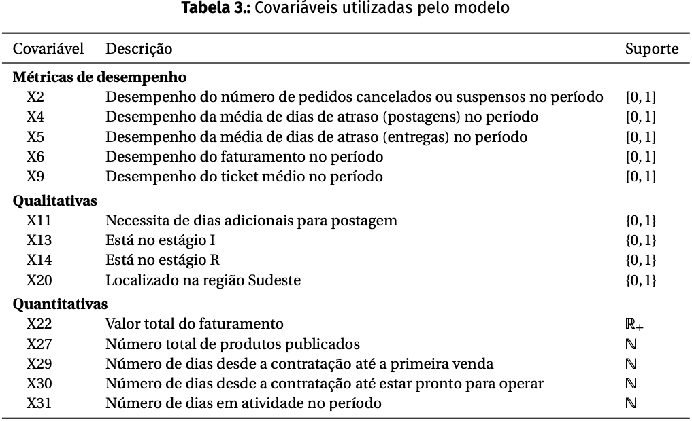
```

## Análise dos resíduos

- Resíduos quantílicos aleatorizados
  - $r_i = \phi^{-1}(u_i)$
  - $\phi^{-1}$: inversa da função de distribuição acumulada da normal padrão
  - $u_i = F(y_i;\mu_i,\phi)$: com base na distribuição acumulada do modelo proposto
  - Normalmente distribuídos e com variância constante

## Análise dos resíduos

- Variabilidade constante, centrados predominantemente entre -2 e 2
- Aderentes à distribuição normal
- Não houve violação dos pressupostos

## Análise dos resíduos

```{r, out.width='100%'}
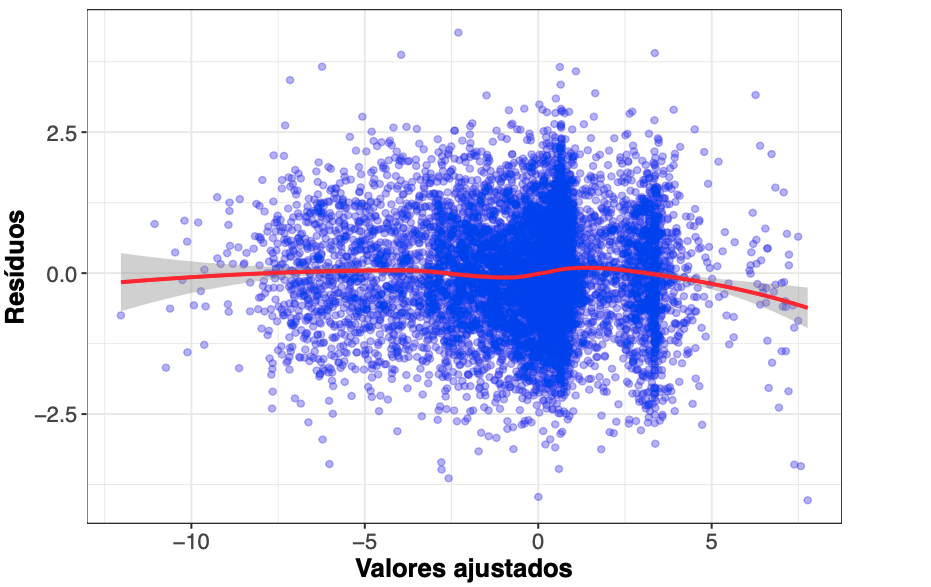
```

## Análise dos resíduos

```{r, out.width='100%'}
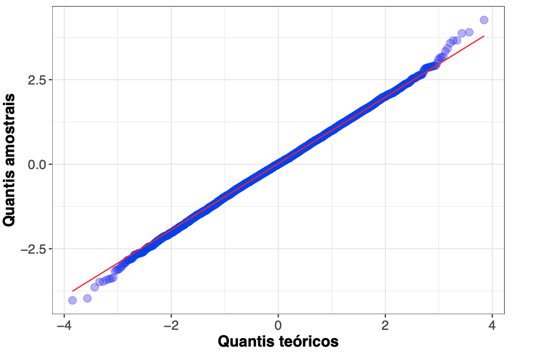
```

## Interpretação das estimativas dos parâmetros

```{r, out.width='70%'}
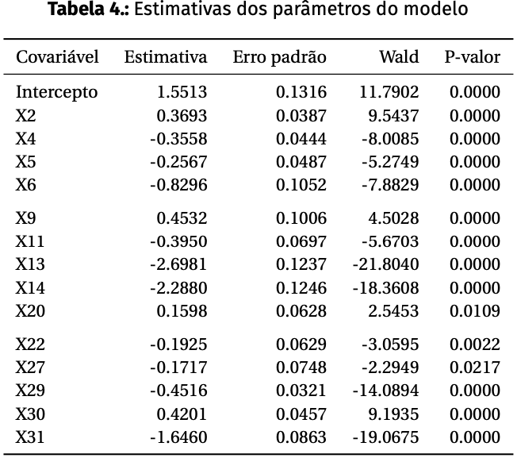
```

## Interpretação das estimativas dos parâmetros

- Fatores que mais impactam na redução da chance de \textit{churn}:
  - Aumento do número de dias em atividade no perído (X31)
  - Estar no estágio I (X13) ou no estágio R (X14)
  - Melhora do desempenho do faturamento (X6)

## Interpretação das estimativas dos parâmetros

```{r, out.width='70%'}
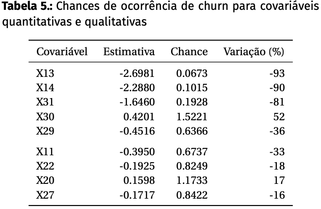
```

## Interpretação das estimativas dos parâmetros

```{r, out.width='70%'}
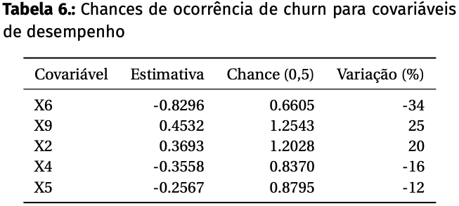
```

## Escolha do cutoff

sadfas

<!-- - Variável resposta: clientes inativos por 30 dias corridos = *churn* (Y=1) -->
<!-- - Avaliação dos últimos 90 dias de histórico do cliente -->
<!--   - Período dividido em duas partes e avaliado o desempenho -->
<!--   - Criação de diversas métricas de desempenho  -->
<!-- - Inclusão de covariáveis qualitativas e quantitativas globais (calculadas não só no período de 90 dias) -->
<!-- - 32 variáveis e 11.131 observações -->

<!-- ## Ajuste do modelo de regressão logistica -->

<!-- - Seleção de covariáveis com o algoritmo *stepwise* -->
<!--   - Múltiplo de penalização: 3,841459 ($\chi^2$ com 1 grau de liberdade e 5% de significância) -->
<!-- - Validação cruzada K-fold com 5 folds -->

<!-- # Resultados e discussão -->

<!-- ## Teste da razão da verossimilhança -->

<!-- - Comparação do modelo completo com o modelo obtido pelo algoritmo *stepwise* -->
<!-- - Constatado que a eliminação de 17 covariáveis não afetou a qualidade do ajuste do modelo -->

<!-- ## Análise de diagnóstico -->

<!-- - Resíduos quantílicos aleatorizados -->

<!-- ```{r, out.width='80%'} -->
<!--  -->
<!-- ``` -->

<!-- ## Análise de diagnóstico -->

<!-- - Resíduos quantílicos aleatorizados -->

<!-- ```{r, out.width='80%'} -->
<!--  -->
<!-- ``` -->

<!-- ## Análise de diagnóstico -->

<!-- ```{r, out.width='80%'} -->
<!-- 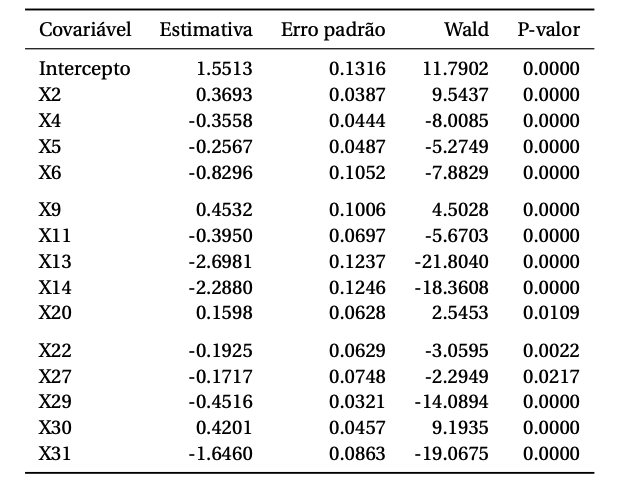 -->
<!-- ``` -->

<!-- ## Interpretação das estimativas -->

<!-- - Covariáveis que mais impactam na redução da chance de *churn*: -->
<!--   - X31 (número de dias em atividade no período) -->
<!--   - X13 (cliente estar no estágio I) -->
<!--   - X14 (cliente estar no estágio R) -->
<!--   - X16 (melhora no desempenho do faturamento) -->

<!-- ## Avaliação do poder preditivo do modelo -->

<!-- ```{r, out.width='90%'} -->
<!-- 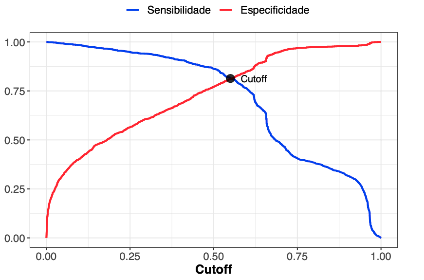 -->
<!-- ``` -->

<!-- ## Avaliação do poder preditivo do modelo -->

<!-- ```{r, out.width='90%'} -->
<!-- 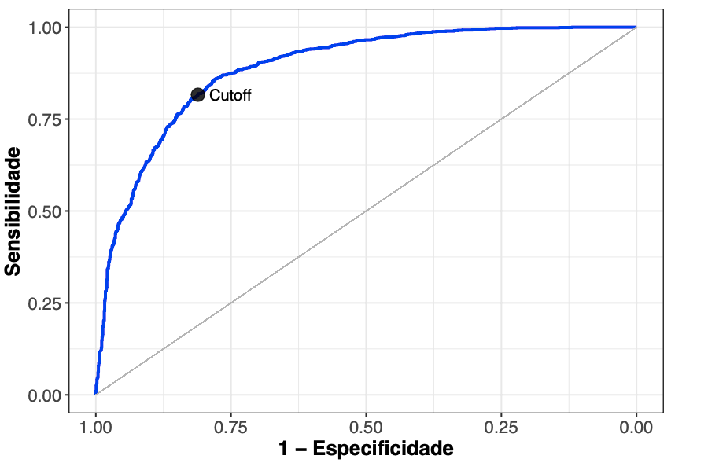 -->
<!-- ``` -->

<!-- ## Avaliação do poder preditivo do modelo -->

<!-- - Sensibilidade: 0,8164 -->
<!-- - Especificidade: 0,8111 -->
<!-- - Acurácia: 0,8136 -->

<!-- # Conclusões -->

<!-- ## Considerações finais -->

<!-- - O modelo proposto é capaz de atender a necessidade do negócio -->
<!--   - Poder de predição -->
<!--   - Interpretabilidade -->
<!-- - A abordagem utilizada na definição da variável resposta e métricas de desempenho demonstrou-se eficaz -->